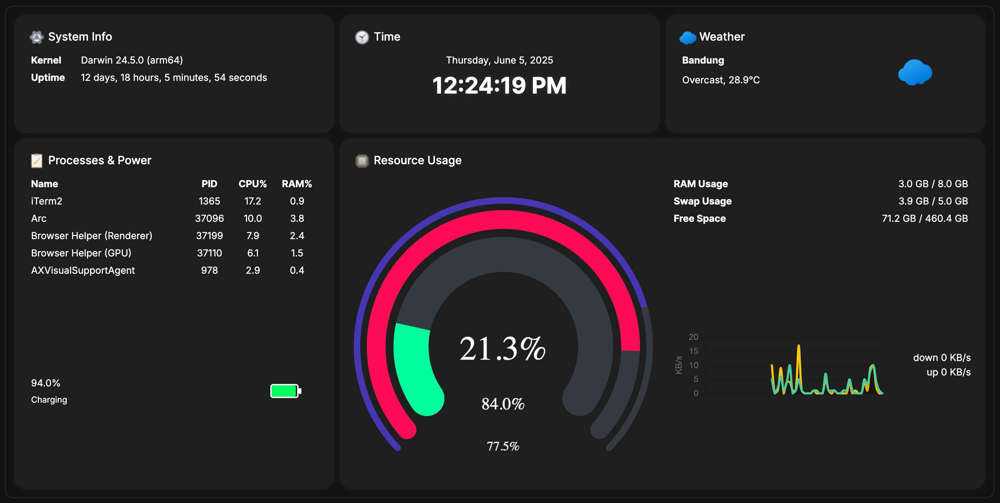

# 🔧 System Monitoring Dashboard

A lightweight, modern and responsive system monitoring dashboard (inspired by Turing Smart Screen) built with:
- 🐍 Python (`psutil`, `Flask`)
- 📊 Chart.js for visualizing CPU, RAM, SWAP, network and battery data
- ☁️ Weather & time widgets
- 🌐 Web-based frontend, runs on any modern browser


## 🚀 Features

- **Real-time system metrics**: CPU usage, memory, disk, swap, battery, uptime
- **Beautiful charts**: Radial usage charts and network history line graphs
- **Weather integration** using [Open-Meteo](https://open-meteo.com/)
- **Auto-refreshing UI** every 5 seconds
- **Responsive dark mode layout**
- **Portable**: Runs on macOS (tested), Linux (not tested yet), Raspberry Pi (not tested yet) & Windows (not tested yet)


## 🖥️ Preview




## 🔧 Requirements

- Python 3.7+
- pip (Python package manager)


## 📦 Installation

### **1. Clone the Repository**
```bash
git clone https://github.com/abz89/sysmon.git
cd sysmon
```

### **2. Create a Virtual Environment**

#### **On macOS/Linux:**
```bash
python3 -m venv venv  # Create virtual environment
source venv/bin/activate  # Activate the virtual environment
```

#### **On Windows:**
```bash
python -m venv venv  # Create virtual environment
.\venv\Scripts\activate  # Activate the virtual environment
```

### **3. Install Dependencies**
Make sure you have a `requirements.txt` file in your repository. Install the required Python packages with:
```bash
pip install -r requirements.txt
```


## 🧪 Usage

You can run the app in three modes:

### 1. API only

```bash
python systems_monitoring.py --mode api --port 8000
```

### 2. Frontend only (pointing to remote API)

```bash
python systems_monitoring.py --mode frontend --api-host <API_HOST> --api-port <API_PORT>
```

### 3. Both API + frontend (recommended for local dashboard)

```bash
python systems_monitoring.py --mode both --port 8000
```
Then open: [http://localhost:8000](http://localhost:8000)


## ⚙️ Configuration

- Weather location is hardcoded via latitude & longitude. You can edit it in `index.html`
- Chart update interval can be changed via `setInterval()` in JS
- Responsive layout based on Bootstrap 5 grid


## 📁 File Structure
```

└── LICENSE					
├── media/
│   ├── preview.png
└── README.md						# this document
├── requirements.txt     		# Python dependencies
├── static/
│   ├── index.html       		# Main dashboard UI
├── systems_monitoring.py		# Backend API server using Flask
```


## 📜 License

This project is licensed under the **MIT License** – see the [LICENSE](LICENSE) file for details.


## 🤝 Contributing

Pull requests are welcome! For major changes, please open an issue first to discuss what you would like to change or improve.


## ❤️ Acknowledgments
- [psutil](https://github.com/giampaolo/psutil)
- [Chart.js](https://www.chartjs.org/)
- [Bootstrap 5](https://getbootstrap.com/)
- [Open-Meteo](https://open-meteo.com/)
